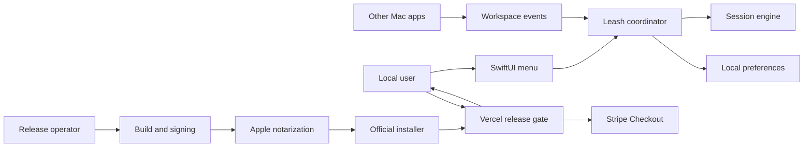

# Leash Threat Model

## Executive summary

Leash has a small remote attack surface because the runtime has no network client, server, account, third-party dependency, telemetry, or dynamic code loading. The highest risks are distribution impersonation for an open-source direct-download app, loss of the emergency release path during computer-wide focus enforcement, and availability issues caused by metadata supplied by other local applications. The hardened design pins official releases to Apple Team ID `QWT6LQP2GH`, validates and limits app-level metadata, collects no window or document content, and fails open when anchor or persisted-state integrity checks fail.

## Scope and assumptions

- In scope: the native sources and package, release scripts, the static website and serverless release APIs, and release documentation.
- Runtime model: a single-user native macOS menu bar application distributed outside the Mac App Store.
- Distribution model: public open-source source code with official Developer ID signed and notarized binaries.
- Data sensitivity: task and completion text may contain private project or client names.
- Internet exposure: none in the Mac runtime. The public website runs on Vercel, and its serverless API exposes release availability and creates Stripe Checkout sessions when payment is enabled.
- Authentication and authorization: none. macOS user-session isolation and TCC protect local access.
- Out of scope: Apple notarization, Vercel, and Stripe service internals; a compromised macOS kernel or root attacker; and third-party forks that do not claim to be official builds.

Open questions that could change risk ranking:

- The automatic-update design is not selected yet.
- Signing-key custody and recovery procedures are not documented outside this repository.

## System model

### Primary components

- SwiftUI menu bar UI collects the task, completion definition, mode, and allowed applications. Evidence: `Sources/LeashApp/LeashMenuView.swift`, `LeashMenuView`.
- `LeashCoordinator` observes `NSWorkspace`, applies app-level focus policy, and manages the overlay. Evidence: `Sources/LeashApp/LeashCoordinator.swift`, `applicationActivated(_:)`.
- `SessionEngine` validates task state, decides whether an app is allowed, and bounds app-level history. Evidence: `Sources/LeashCore/SessionEngine.swift`.
- `StateStore` encodes bounded, normalized state to local `UserDefaults`. Evidence: `Sources/LeashApp/StateStore.swift`.
- The release script builds a universal binary, signs it, submits notarization, staples the ticket, validates Gatekeeper, and emits a checksum. Evidence: `scripts/package-macos.sh`.
- The website exposes the download only when `LEASH_DOWNLOADS_ENABLED` is explicitly enabled, and exposes paid checkout only when both the release and Stripe configuration are available. Evidence: `website/api/config.js`, `website/api/checkout.js`, and `website/app.js`.

### Data flows and trust boundaries

- User -> SwiftUI UI: task text, completion text, duration, mode, and app choices cross through local UI events. There is no authentication or encryption because this is the current local user session. Text length and session duration are validated by `InputLimits` and `SessionEngine.start`.
- Other applications -> `NSWorkspace` -> `LeashCoordinator`: activation events, bundle identifiers, localized names, and process IDs cross macOS workspace notifications. The OS supplies process objects, while names and bundle metadata can originate in another app bundle. Values are length-bounded and empty identities are rejected.
- `LeashCoordinator` -> `StateStore` -> macOS preferences: session state and app-level history cross JSON serialization into a user-owned preference file. State size, counts, dates, strings, and known stop reasons are normalized.
- Source changes -> privacy QA gate: Swift source is rejected if it adds external package dependencies or known networking, telemetry, crash reporting, or activity logging APIs. This is a regression control, not a substitute for review.
- Developer checkout -> release script -> Apple signing services: source, Git state, a Keychain notary profile, and a Developer ID identity cross local process and Apple service boundaries. Release mode requires a clean matching version tag, Hardened Runtime, a timestamp, notarization, and Team ID `QWT6LQP2GH`.
- Release archive -> Vercel -> user Mac: the DMG crosses the HTTPS download boundary only after an operator enables the notarized release. Gatekeeper checks Developer ID and notarization. Users can compare the published checksum and embedded source commit.
- Browser -> Vercel API -> Stripe: a selected whole-euro amount crosses the website API before Stripe hosts payment. The endpoint stays closed while downloads are disabled and returns no secret configuration to the browser.

#### Diagram

## Assets and security objectives

| Asset | Why it matters | Security objective (C/I/A) |
|---|---|---|
| Task and completion text | May reveal private work context | C, I |
| Active session policy | Controls which applications Leash hides or activates | I, A |
| Emergency release controls | Prevent the user from becoming trapped in focus enforcement | A, I |
| Persisted Leash state | Restores behavior after restart | I, A |
| Developer ID private key and notary credentials | Establish official binary identity | C, I |
| Official release archive and source commit | Users rely on them to distinguish official builds from forks | I, A |

## Attacker model

### Capabilities

- A remote attacker can publish a lookalike fork, tampered archive, or phishing download but cannot directly send data to the Leash runtime.
- A malicious application running as the same macOS user can control its own bundle metadata, generate activation events, compete for global hotkeys, and modify that user's preferences.
- A malicious source contributor can propose changes to runtime or release scripts.
- An attacker who compromises the release account or signing key can produce a more convincing malicious build.

### Non-capabilities

- A network-only attacker cannot reach a listener, API, updater, or telemetry endpoint because none exists.
- Leash does not request Accessibility, Screen Recording, Input Monitoring, or Automation permission.
- A local same-user attacker is not assumed to have root, kernel, or Apple notarization-service compromise.
- Bundle identifiers are labels, not security identities. Leash does not claim to isolate hostile local code.

## Entry points and attack surfaces

| Surface | How reached | Trust boundary | Notes | Evidence (repo path / symbol) |
|---|---|---|---|---|
| Task setup UI | User opens menu bar panel | User to app | Bounded text and duration | `Sources/LeashCore/SessionEngine.swift`, `start` |
| App activation notifications | Any local app becomes active | Local app to Leash | Drives allow, nudge, or pull-back action | `Sources/LeashApp/LeashCoordinator.swift`, `applicationActivated` |
| Global release hotkey | macOS Carbon event system | OS event to Leash | Primary and fallback registration are checked | `Sources/LeashApp/ReleaseHotKey.swift`, `register` |
| Persisted JSON state | App launch through `UserDefaults` | User preference file to runtime | Size and structural validation fail open | `Sources/LeashApp/StateStore.swift`, `load` |
| Anchor activation | Pull back or user action | Persisted app identity to OS process lookup | Only an already-running anchor is activated | `Sources/LeashApp/LeashCoordinator.swift`, `activate` |
| Release environment | Operator runs release script | Shell and Keychain to build artifact | Inputs are quoted, signer and Git provenance checked | `scripts/package-macos.sh` |
| Public archive | User downloads official build | Vercel to user Mac | Disabled until Developer ID signing, notarization, and Gatekeeper verification pass | `website/api/config.js`, `SECURITY.md` |
| Checkout API | Browser submits a selected amount | Browser to Vercel to Stripe | Disabled with the download gate; validates whole-euro pricing and keeps the Stripe key server-side | `website/api/checkout.js` |

## Top abuse paths

1. A remote attacker publishes a modified open-source fork using the Leash name, directs users to the unofficial download, and gains the permissions users grant to that binary.
2. A release-host compromise replaces the ZIP and checksum together, causing users who skip Developer ID inspection to install a tampered build.
3. Another app registers the primary emergency shortcut before Leash launches, attempting to remove the fastest escape from Pull me back mode.
4. A malicious local app rapidly generates activation events, attempting to churn the intervention UI or consume resources.
5. A malicious app supplies extremely large names or bundle metadata, attempting to consume memory, fill preferences, or destabilize rendering.
6. A same-user process tampers with persisted session dates or mode so Leash restores an unwanted lock session after restart.
7. An app or stale Launch Services registration reuses an anchor bundle identifier, attempting to be treated as allowed or activated as the task app.
8. A compromised signing identity produces a notarized-looking official build with malicious computer-wide behavior.

## Threat model table

| Threat ID | Threat source | Prerequisites | Threat action | Impact | Impacted assets | Existing controls (evidence) | Gaps | Recommended mitigations | Detection ideas | Likelihood | Impact severity | Priority |
|---|---|---|---|---|---|---|---|---|---|---|---|---|
| TM-001 | Remote distributor or compromised host | User downloads from an unofficial or modified location | Distribute a malicious fork under the Leash name | Code execution under the user's account | Official binary identity, user data | Developer ID, notarization, Team ID pin, source commit, checksum (`scripts/package-macos.sh`, `SECURITY.md`) | No official host or updater yet | Publish from one HTTPS origin, sign update metadata, document Team ID beside every download | Monitor certificate use and release-host changes | Medium | High | high |
| TM-002 | Local application or hotkey conflict | Another process owns a configured key combination | Prevent global emergency release registration | User loses the fastest escape from focus enforcement | Emergency controls, availability | Checked primary and fallback hotkey registration; menu Release and Quit remain (`Sources/LeashApp/ReleaseHotKey.swift`) | All candidate shortcuts can theoretically conflict | Show registration status, retain two menu escape paths, test shortcut collision before release | Local QA verifies actual registered shortcut | Medium | Medium | medium |
| TM-003 | Malicious local app | App can rapidly activate or supply unusual bundle metadata | Churn workspace notifications or oversized app labels | UI disruption or local resource pressure | Availability, emergency controls | Event-driven handling, bounded identities and history, no idle polling (`LeashCoordinator`, `InputLimits`) | OS workspace delivery remains a trusted dependency | Keep handlers bounded and retain emergency release paths | Stress-test repeated activation and inspect catch caps | Medium | Low | low |
| TM-004 | Future contributor or dependency | A change adds telemetry, logging, or a network path | Transmit task or app activity without clear consent | Confidentiality loss and broken privacy promise | Task text, app activity | No current network or logging code, no external dependencies, automated source gate (`scripts/qa-macos.sh`) | Static patterns cannot detect every indirect implementation | Require privacy review for every dependency or outbound feature and keep the data inventory current | Review binary links and release diffs; test with a network monitor | Low | High | medium |
| TM-005 | Same-user process | Ability to modify the user's preferences | Inject invalid dates, large collections, or lock mode into saved state | Unwanted focus enforcement or local denial of service | Persisted policy, availability | 256 KiB cap, count and text limits, structural validation, fail-open invalid state (`StateStore.load`, `restoredState`) | Same-user processes can still stop or alter Leash | Treat preferences as convenience state, never authority; preserve Release and Quit | Record an `invalid-state` reason locally | Low | Low | low |
| TM-006 | Malicious local app | App can use a copied bundle identifier | Bypass allowlist or impersonate a stale anchor | Focus-policy integrity loss or activation of the wrong running app | Session policy | Missing anchors release the session; Leash never launches an absent anchor (`LeashCoordinator.activate`) | Bundle ID is still not cryptographic identity | Optionally record code-signing identity for allowed apps in a later release | Surface anchor path and signer in diagnostics | Low | Medium | low |
| TM-007 | Compromised contributor or release workstation | Ability to modify source, PATH, Git state, or signing credentials | Publish a malicious official artifact | Trusted code execution on user Macs | Signing key, official archive | No dependencies, restricted release PATH, clean matching tag, team pin, Hardened Runtime, notarization (`scripts/package-macos.sh`) | No CI provenance or hardware-backed key policy documented | Add reviewed CI release provenance and restrict certificate access | Audit Git tags, Apple certificate events, and release checksums | Low | High | high |

## Criticality calibration

- Critical: compromise that reliably turns the official distribution channel into remote code execution at scale. Examples include theft of the Developer ID key plus release-host control, or a pre-install execution flaw in the official archive. No current critical issue was found.
- High: compromise of official artifact integrity or code execution that requires one meaningful prerequisite. Examples include a malicious notarized release from a compromised workstation, a convincing public lookalike, or a future unsigned updater accepting attacker-controlled metadata.
- Medium: local availability or confidentiality harm without privilege escalation. Examples include blocking all emergency release paths or adding undisclosed telemetry in a future change.
- Low: focus-policy bypass or nuisance requiring code already running as the same user. Examples include bundle-ID spoofing, preference tampering that fails open, or forcing history truncation.

## Focus paths for security review

| Path | Why it matters | Related Threat IDs |
|---|---|---|
| `Sources/LeashApp/LeashCoordinator.swift` | Owns OS notifications, hiding, activation, and lifecycle races | TM-002, TM-003, TM-006 |
| `Sources/LeashApp/ReleaseHotKey.swift` | Implements the emergency release path and conflict handling | TM-002 |
| `Sources/LeashApp/StateStore.swift` | Deserializes local persisted state and enforces the storage cap | TM-004, TM-005 |
| `Sources/LeashCore/SessionEngine.swift` | Validates policy and limits attacker-controlled app metadata | TM-003, TM-005 |
| `Sources/LeashCore/Models.swift` | Defines all persisted and externally derived data | TM-003, TM-005, TM-006 |
| `Sources/LeashApp/OverlayController.swift` | Presents nonactivating computer-wide UI and escape actions | TM-002, TM-003 |
| `scripts/package-macos.sh` | Establishes the official artifact identity and notarization chain | TM-001, TM-007 |
| `Support/Info.plist` | Defines the public bundle identity and release metadata | TM-001, TM-004 |
| `SECURITY.md` | Tells users how to distinguish official binaries from forks | TM-001, TM-007 |

## Quality check

- Covered every discovered runtime entry point: UI, workspace events, hotkey events, persisted state, anchor activation, and release inputs.
- Covered every identified trust boundary in at least one threat.
- Separated runtime behavior from build and release tooling.
- Reflected the confirmed public open-source direct-download model and minimal app-level data collection.
- Kept the unresolved hosting, updater, and signing-key custody questions explicit.
